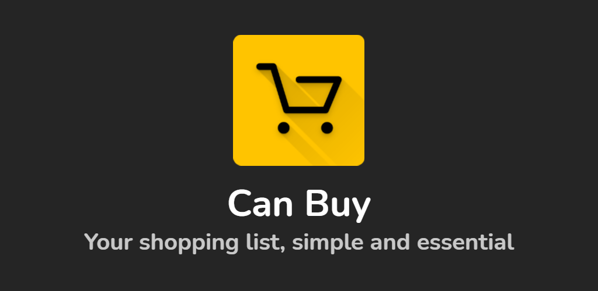
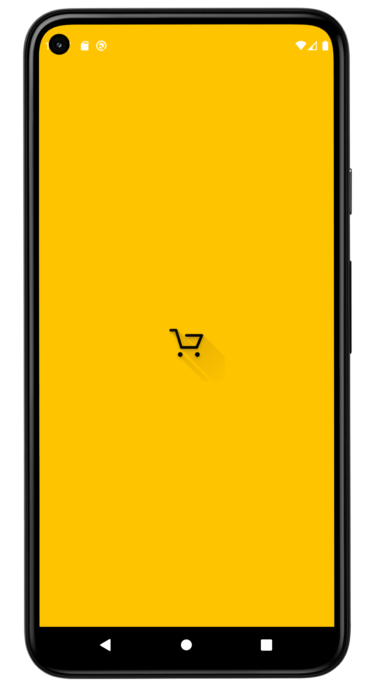
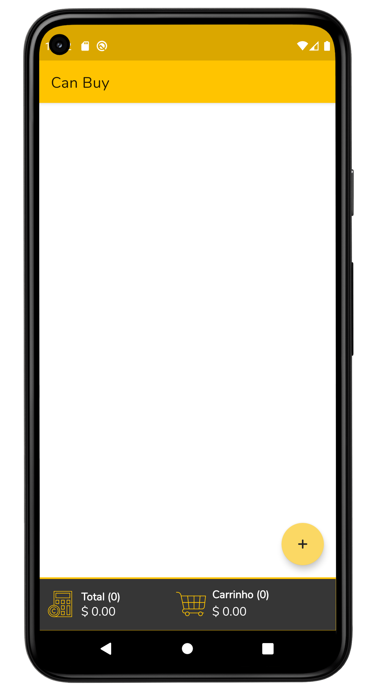
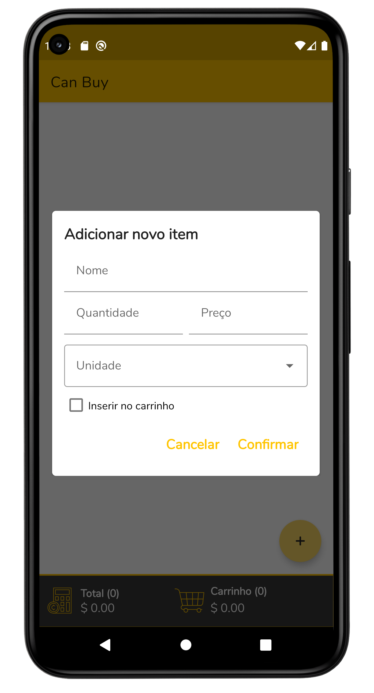
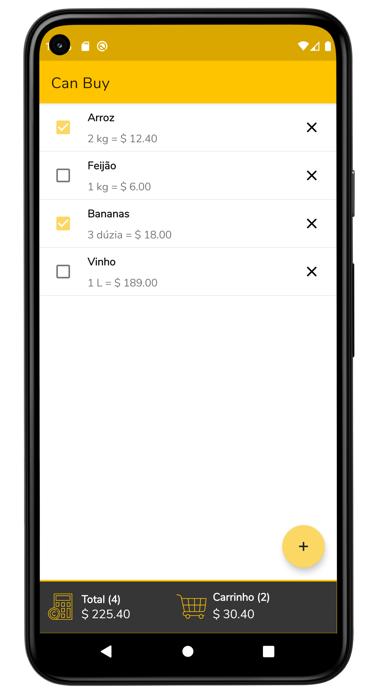

# Can Buy
Can Buy é um aplicativo de lista de compras que vai te ajudar a se organizar e ganhar tempo na hora de fazer as suas compras. Além de simples, Can Buy é essencial para te auxiliar na administração da rotina do seu lar.

## Construído com  🛠

- [Kotlin](https://kotlinlang.org/docs/android-overview.html) - Linguagem de programação oficial para desenvolvimento Android.
- [Coroutines](https://kotlinlang.org/docs/reference/coroutines/coroutines-guide.html) - Para executar o código de forma assíncrona.
- [Flow](https://kotlin.github.io/kotlinx.coroutines/kotlinx-coroutines-core/kotlinx.coroutines.flow/-flow/) -  É  stream de dados que pode emitir vários valores sequencialmente.
- [Componentes da arquitetura do Android](https://developer.android.com/topic/libraries/architecture) - É um conjunto de bibliotecas que ajuda a projetar apps robustos.
  - [LiveData](https://developer.android.com/topic/libraries/architecture/livedata) - Usado para criar objetos de dados que notificam as visualizações quando o banco de dados subjacente é modificado.
  - [ViewModel](https://developer.android.com/topic/libraries/architecture/viewmodel) - Armazena dados relacionados à IU que não são destruídos em rotações de apps.
  - [Room](https://developer.android.com/topic/libraries/architecture/room) - É uma biblioteca de mapeamento de objetos SQLite. 
  - [View Binding](https://developer.android.com/topic/libraries/view-binding) - É um recurso que facilita a programação de códigos que interagem com visualizações.
- [Material Design para Android](https://developer.android.com/guide/topics/ui/look-and-feel) - É um guia abrangente para design visual, de animação e interação entre plataformas e dispositivos.

## Arquitetura
Can Buy usa a arquitetura [***MVVM (Model View View-Model)***](https://developer.android.com/jetpack/docs/guide#recommended-app-arch).

## Screenshots

## License

[MIT](LICENSE.md)
